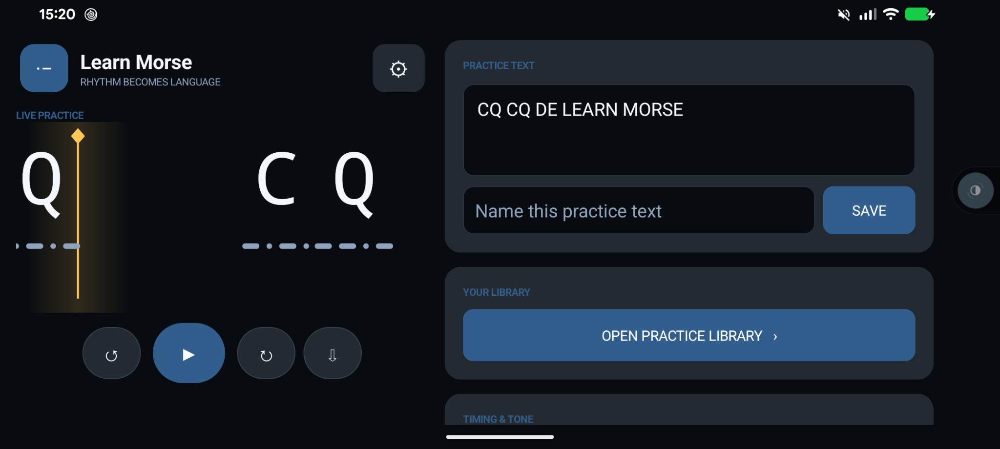
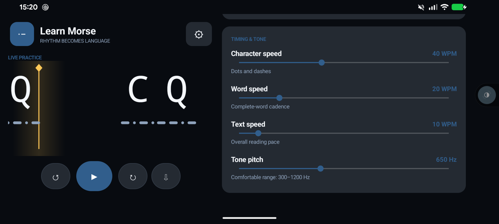

# Learn Morse

Learn Morse is a friendly, dependency-free Morse code trainer for the browser, with a native Android companion app. Type any phrase, listen to its rhythm, and follow each character and Morse pattern as it moves across the playhead.

It is designed for focused, repeatable practice: tune the pace to your level, save useful exercises, loop difficult passages, and export the generated audio for practice away from the screen.

**[Open the web app](https://wheresjames.github.io/learnmorse/)**



## Table of contents

- [Highlights](#highlights)
- [Quick start](#quick-start)
- [Using Learn Morse](#using-learn-morse)
- [Timing and customization](#timing-and-customization)
- [Saving and privacy](#saving-and-privacy)
- [Static browser version](#static-browser-version)
- [Android app](#android-app)
- [Project layout](#project-layout)

## Highlights

- Synchronized Morse audio and a smooth, scrolling visual display
- Separate character, word, and overall text speeds from 5–100 WPM
- Adjustable tone pitch (300–1200 Hz) and volume
- A library of named practice texts, including starter exercises
- Play, pause, restart, seek, and continuous repeat controls
- A draggable playhead for calibrating visual and audio alignment
- Custom colors, text size, and Morse-symbol size
- Offline audio export: WAV in the browser, or WAV and M4A/AAC on Android
- Persistent settings and practice texts, stored locally
- No Python packages, accounts, analytics, or cloud services required

## Quick start

You only need Python 3:

```bash
python3 learnmorse.py
```

Learn Morse starts at `http://127.0.0.1:8765` and opens your default browser. Enter some text and press the blue play button—or press <kbd>Space</kbd> while focus is outside a form field.

To choose a different port:

```bash
python3 learnmorse.py --port 9000
```

Useful server options:

```text
--port, -p PORT   Port to listen on (default: 8765)
--host HOST       Address/interface to bind (default: 127.0.0.1)
--no-browser      Start without opening a browser
```

For example, to make the app available to other devices on your local network:

```bash
python3 learnmorse.py --host 0.0.0.0
```

Then open `http://<computer-ip>:8765` on the other device. Only do this on a network you trust; the built-in server has no authentication.

## Using Learn Morse

1. Enter a callsign, phrase, or longer exercise in **Practice text**.
2. Adjust the timing and tone controls to a comfortable level.
3. Select **Play** and follow the character crossing the gold playhead.
4. Use the progress slider to revisit a section, or enable repeat for a continuous loop.
5. Give the exercise a name and select **Save text** to add or update it in your library.

The download button creates an audio file using the current text, speed, pitch, and volume. This is handy for listening drills or transferring an exercise to another device.

## Timing and customization



The three speed controls let you use Farnsworth-style spacing without changing the sound of individual characters:

- **Character speed** controls the dots and dashes within each character.
- **Word speed** controls character cadence and cannot exceed the character speed.
- **Text speed** controls the overall reading pace and cannot exceed the word speed.

The settings button also lets you change the character and Morse-symbol sizes, volume, interface colors, accent color, and playhead color. Drag the playhead left or right if your device needs a small visual/audio alignment adjustment. All of these choices persist between sessions.

## Saving and privacy

When you run the Python server, state is saved to:

```text
./data/learnmorse/state.json
```

The file contains your settings, current draft, and saved practice texts. Writes are performed atomically to reduce the chance of a partial state file. Stop the server at any time with <kbd>Ctrl</kbd>+<kbd>C</kbd>.

Learn Morse is local-first: practice text and settings stay on your device unless you choose to share the server on your network or copy an exported audio file elsewhere.

## Static browser version

The files in `web/` can be used without the Python backend. Serve that directory with any static web server:

```bash
python3 -m http.server 8765 --directory web
```

Then visit `http://127.0.0.1:8765`. In static mode, Learn Morse automatically stores settings and practice texts in that browser's local storage. You can also open `web/index.html` directly, although browser rules for `file://` storage vary; a static server is more reliable.

## Android app

The native Kotlin app lives in `android/` and supports Android 8.0 (API 26) or newer. It offers the same core practice experience, uses Android private preferences for local state, and can export either compact M4A/AAC audio or lossless WAV audio.

To build it, install JDK 17 and an Android SDK that includes API 35, then run from the repository root:

```bash
./android/gb.sh android-build
```

Build outputs include:

```text
android/build/outputs/apk/debug/android-debug.apk
android/build/outputs/bundle/debug/android-debug.aab
```

You can also use the standard Gradle wrapper directly:

```bash
./gradlew :android:assembleDebug
```

The APK can then be installed with Android Studio or `adb install android/build/outputs/apk/debug/android-debug.apk`.

## Project layout

```text
learnmorse.py     Dependency-free HTTP server and JSON persistence API
web/              Browser interface, styling, playback, and audio export
android/          Native Android application and build helper
data/learnmorse/  Local server-side state
docs/images/      Screenshots used in this README
```

That is all there is to it—start slowly, listen for the rhythm instead of counting individual dots and dashes, and raise the speed when recognition begins to feel automatic.
